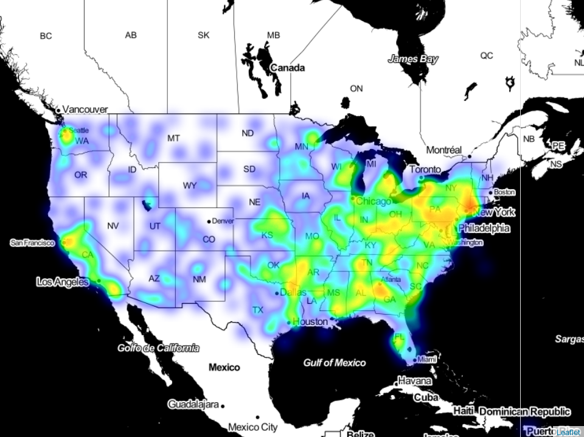

# assignment-sunscrapers

## Task Descrition
Data Warehouse Prototype Project
Download Data

We will be exploring Lending Club’s loan origination data from 2007-2015. Please download the dataset in CSV format (loan.csv) and associated dictionary (LCDataDictionary.xlsx) from https://www.kaggle.com/wendykan/lending-club-loan-data.

### Part 1: Data Exploration and Evaluation
Create an exploratory data analysis project. Load the data and perform any necessary cleaning and aggregations to explore and better understand the dataset

### Part 2: Data Pipeline Engineering
Please build a prototype of a production data pipeline that will feed an analysis system (data warehouse) based on this dataset. This system will allow data scientists and data analysts to interactively query and explore the data, and will also be used for machine learning model training and evaluation. Assume that the system will receive periodic updates of this dataset over time, and that these updates will need to be processed in a robust, efficient way.

For this section, please:

    Create a data model / schema in a database or storage engine of your choice
    Develop code that will persist the dataset into this storage system
    Include any data validation routines that you think may be necessary
    Use your choice of geospatial python package and create spatial analysis
        Loan.csv file has addr_state. Please aggregate loan data for states and visualize it.

Prioritize simplicity in your data model and processing code. Explain your thought process.

### Mechanics
Use the tools, programming languages and frameworks that you are most comfortable with. We primarily use Jupyter, Python and SQL, but this is not a requirement.

Submit all code and documentation via GitHub. Please include all code files, outputs, and visualizations in the repository. Do not include any passwords or secrets in your code. Include a documentation file with your project. Please assume that your work will be shared with data engineers as well as data scientists and software engineers in a collaborative environment. 

## Solution
### Part 1: Exploratory Data Analysis
#### Runing using Google Colab
The Exploratory Data Analysis (EDA) part is achieved using of Google-hosted instance of Jupyter notebook. The notebook is available as a file:  `./Exploratory-Data-Analysis.ipynb`, which needs to be uploaded to [Google Colab](https://colab.google.com).
For convinence, the datasets are hosted using Google Drive, but it is also possible to upload them directly without synching them with the Drive. In this case one has to edit a few lines in the notebook iself, and it is explained therein.

### Viewing using Github
It is possible to view the EDA notebook directly using Github.
However, sometimes the notebook does not render correctly when viewing it directly on Github, we are we are presenting a snapshot of the geospatial analysis here for confirmation:

.

### Running locally
To run the notebook locally, you need it activate a virtual environment and running an instance of the Jupyter noteook. Use the following commands:
```
git clone <this-repo-url>
python3 -m venv env
source env/bin/activate
pip install -r requirements.txt
jupyter notebook
```
This will start an instance of the notebook on `localhost:8888`. 
Use your browser to open the notebook and view it.
Again, please make sure that the datasets paths are correct.


